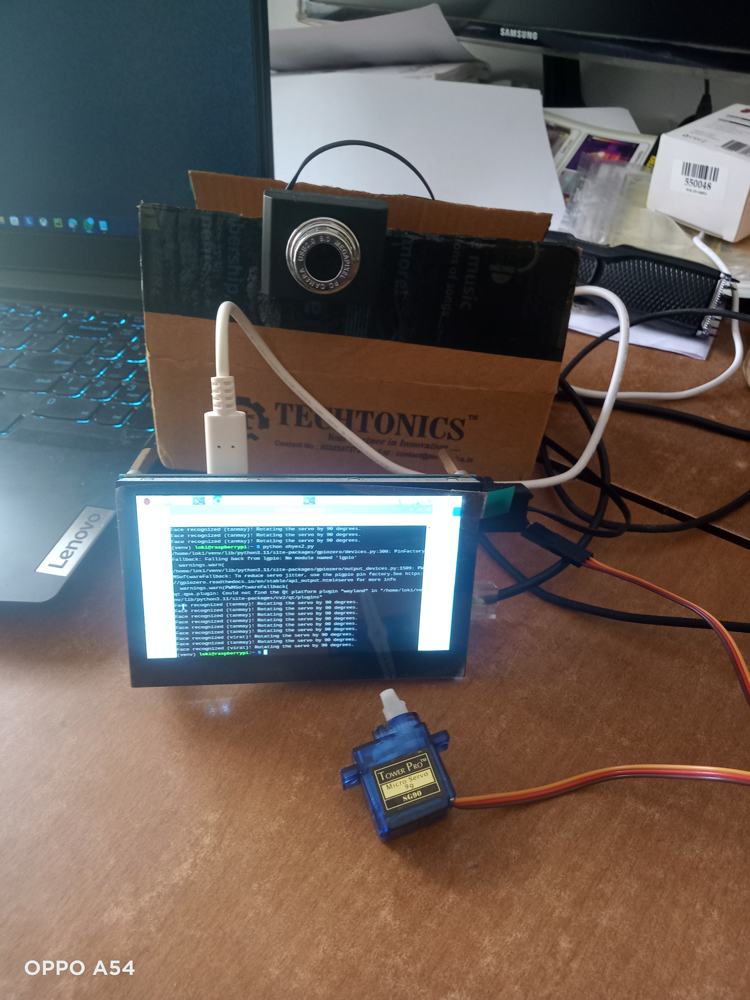
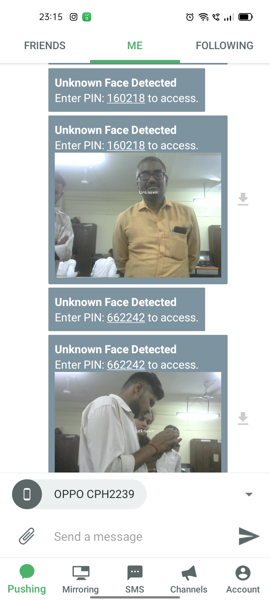
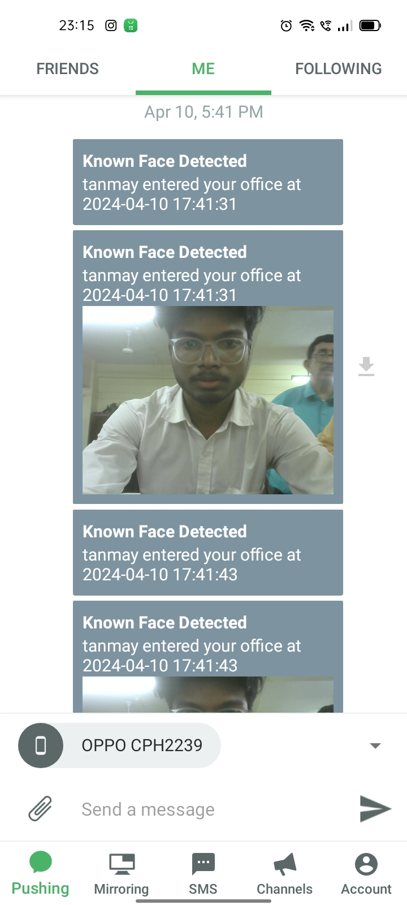

# 🚀 Face Recognition Access Control System with Servo Motor and Pushbullet Integration

This project combines **face recognition**, **servo motor control**, **Pushbullet notifications**, and a **GUI-based PIN entry system** to create an intelligent and secure access control system.

---

## 📋 **Project Overview**
- Detect and recognize authorized faces using **face_recognition** and **OpenCV**.
- Control a **servo motor** for access mechanisms.
- Send **Pushbullet notifications** for both known and unknown face detections.
- Generate a **6-digit PIN code** for unknown faces, allowing temporary access via a GUI keypad.
- Ensure cooldown periods between motor activations to prevent overuse.

---

## 🛠️ **Key Features**
- ✅ **Real-time Face Recognition:** Detects and matches faces against a known database.
- ✅ **Servo Motor Control:** Activates a motor upon recognizing an authorized face.
- ✅ **PIN-Based Access for Unknown Faces:** Temporarily allow access via a GUI keypad.
- ✅ **Pushbullet Notifications:** Alerts sent to your device with face details and access PIN.
- ✅ **GUI Interface:** User-friendly keypad interface for PIN entry.

---

## 💻 **Technologies Used**
- **Python 3.x**
- **OpenCV**
- **face_recognition**
- **gpiozero**
- **Tkinter**
- **Pushbullet API**

---

## 📦 **Installation**

### 1. Clone the Repository
```bash
git clone https://github.com/yourusername/face-recognition-access.git
cd face-recognition-access
```

### 2. Install Dependencies
```bash
pip install face_recognition opencv-python gpiozero pushbullet-python
```

### 3. Set Up Encodings
- Save face encodings in an `encodings.txt` file with the following format:
```
Name encoding1 encoding2 ... encodingN
```

### 4. Configure Pushbullet
- Replace `o.VRM4crr0nOGXk1YTu7f8gFkbkoilcceI` with your **Pushbullet API key**.

### 5. Run the Program
```bash
python access_control.py
```

---

## 📱 **Pushbullet Integration**
- Install Pushbullet on your mobile device.
- Ensure notifications are enabled.

---

## 🎮 **How to Use**
1. Start the system.
2. Authorized faces will activate the servo motor.
3. Unknown faces trigger a PIN notification via Pushbullet.
4. Enter the PIN using the GUI keypad for temporary access.
5. Monitor logs in the terminal.

---

## 🛡️ **Security Measures**
- PIN-based fallback access.
- Cooldown mechanism to prevent motor overuse.
- Notifications for every access attempt.

---

## 🤝 **Contributing**
Feel free to fork this repository and submit pull requests with improvements.

---

## 📝 **License**
This project is licensed under the **MIT License**.

---

## 📧 **Contact**
- **Author:** Tanmay Mohite
- **Email:** tanmayrmohite@gmail.com
- **GitHub:** [Your Profile](https://github.com/tanmaymohite)

---

**Made with ❤️ for Secure Access Control Systems!**

## Actual Implementation
- To see the actual implementation click on it !!!

[](https://drive.google.com/file/d/11CLtqDmUusz-LmnKOIndXp5T23wgQxvr/view?usp=drive_link)

## Notification Part

\n



